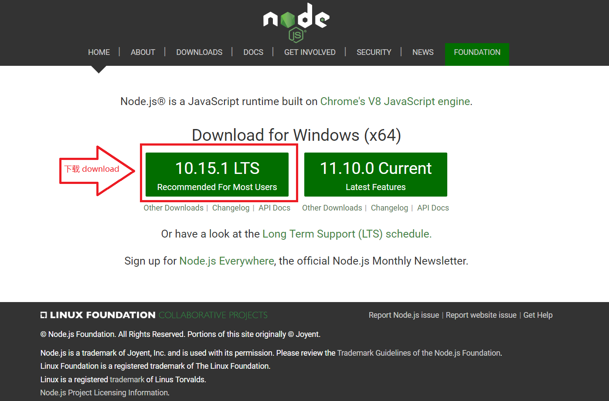
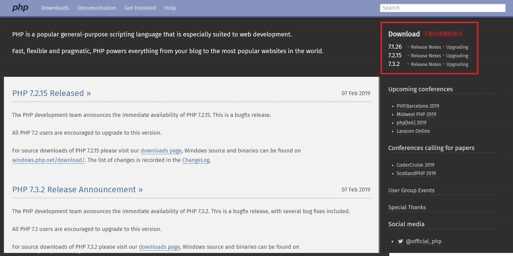

# SRP
SRP是一个提供node运行PHP的解决方式，同时提供了请求转发等操作，或者你可以直接把他看作是一个依靠node运行的服务器解释引擎

## 它到底是啥？
1. 你可以把SRP看作是“Script Run PHP”，但它又不仅仅是脚本运行PHP，它还实现了请求转发与控制面板等功能
2.它是由shanghuo开发的，您可以在网站： www.snang.cc ，去查找关于它的一些最初设计

## srp的作用
- 对于有公网IP但无法绑定域名的服务器，提供域名访问服务。
- 方便了node与PHP的共存。通过不依靠其它服务器解析引擎，如iis和nginx那些，提供对PHP的调用
- 对访问日志进行记录，并且你可以随时随地在控制台查看服务器的资源占用情况

## srp开发进度与缺陷
srp目前刚开始基础的开发。目前的网络传输协议与配置文件未来随时可能改变，不保证向后兼容。

srp的功能还在不断的完善。虽然对于运行PHP来说，它有个众所周知的性能上的一些缺陷。但对于非特大型网站来说，若希望node与php共存，这问题也不算太大。

当前内容在某些node版本中是存在缺陷的，所以代码仅供参考

## 使用示例（无配置文件）：
```
srp({
    port: 80,
    log: "日志输出文件夹",
    "这个站点的名称": {
        dashboard: "控制面板绑定域名",
        user: "控制面板用户名",
        pass: "控制面板密码",
        readdir: "控制面板浏览与下载文件默认起始目录"
    },
    "这个站点的名称": {
        bind: {
            "绑定的域名1": "",
            "绑定的域名2": "附加的路径(原add_path)无附加时留空"
        },
        cgidir: 'php执行文件路径',
        phpdir: "网站根目录",
        errfile: "404错误页文件，如404.htm",
        index: "默认Index文件，如index.php",
        static: [{
            in: /\/blog\/([0-9]*)\.html/,
            out: '/blog/read.php?id=$1'
        }, {
            in: 一个正则表达式,
            out: '用于正则替换的内容(伪静态)'
        }]
    },
    "这个站点的名称": {
        bind: {
            "绑定的域名": "add_path"
        },
        goto: "转发到的服务器地址",
        port: 转发到的服务器端口,
        static: []
    }
});
```

## 使用说明（添加配置文件）：
创建配置文件
1. 创建一个json文件作为配置文件
2. 将无配置文件模式下打开的控制面板中最后一项srp ini中内容复制到配置文件中
3. 在无配置文件调用中，添加iniFile属性，值为配置文件路径
4. 删除无配置文件调用中，除iniFile和port属性外的所有内容

动态更新配置文件
1. 在配置文件中添加reloadTime属性，动态更新配置文件

## 完整的仅通过srp搭建php网站的流程
srp可以当作一个库引入你的项目。也可以直接使用它搭建网站。下面是完整的仅通过srp搭建php网站的流程。

### 1. 下载node
打开[nodejs.org](nodejs.org)下载node并安装  


### 2. 下载srp
将本库中srp文件下载到你的电脑

### 3. 下载php
下载你需要的任意PHP版本  
  
如果你需要配置php.ini那么请按照正常步骤配置php.ini。  
请切记需要下载php-cgi，这个程序文件是我们调用时必须的。

### 4. 配置srp
这里使用最简化配置，将srp中的`srp({`到`});`之间2行改为如下:
- 这里的绑定域名需要你先将域名解析到你这台主机，
- 这里php执行文件路径就是你之前下载php后保存的文件夹中，php-cgi文件路径，如：你将php下载到C盘根目录php文件夹中，那么路径为`c:\\php\\php-cgi.exe`，
- 这里的网站根目录就是你存放网站文件的路径，如：你将网站文件夹建在D盘，文件夹为webSite那么路径为`d:\\webSite`
具体如下：
```
srp({
    port: 80,
    "myWebSite": {
        bind: {
            "127.0.0.1": "",
            "www.绑定的域名": "",
            "绑定的域名": ""
        },
        cgidir: 'php执行文件路径',
        phpdir: "网站根目录",
        static: []
    }
});
```

### 5. 试用
在网站文件夹中添加文件index.php
```
<?php echo phpinfo(); ?>
```
  
通过命令行运行(这里srp.js填你下载的srp文件名)
```
node srp.js
```
  
在你80端口未被占用的情况下，访问`127.0.0.1`，你会看到已经输出了你下载的php的信息。这说明srp已经配置成功了。

## 与node-php等的效率区别
经网友测试（2019年2月14日），本srp在对php-cgi调用方面，比通过npm安装的node-php效率高3.5倍左右。
但在图片加载速度方面，本srp速度堪忧，后续版本中，我们将对这方面进行解决。
